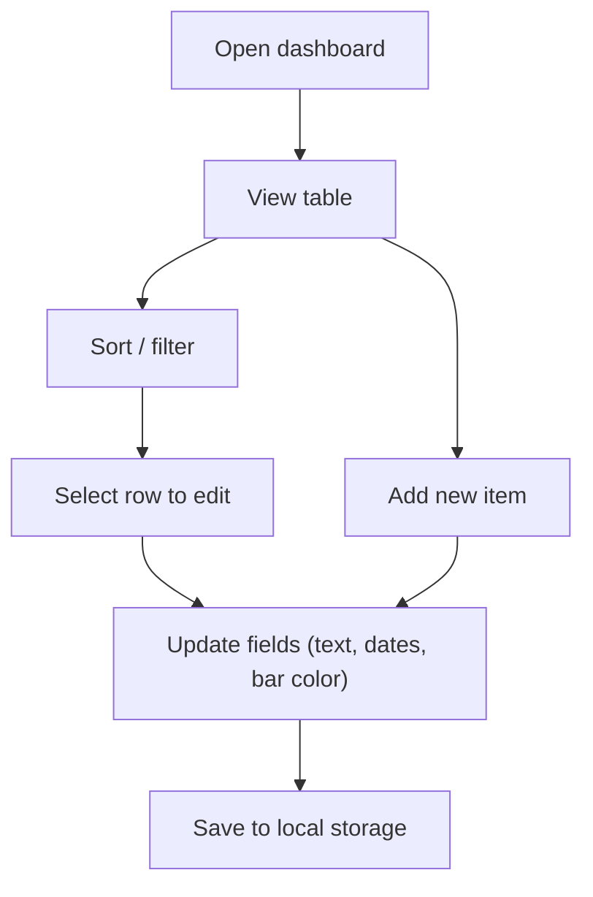

## 1. Product Overview
A single-page web dashboard to manage and track the “Designer Resources Programme” items in a sortable/filterable table with an editable schedule bar per row.
- Purpose: capture programme items, owners, and schedule at a glance; quickly find and update work status
- Target users: Works Manager, Designers, programme coordinators
- Value: replaces ad-hoc spreadsheets with an interactive, always-up-to-date view

## 2. Core Features

### 2.1 User Roles
[Not required] All users share the same permissions in this version.

### 2.2 Feature Module
1. **Programme Dashboard**: table view, add/edit items, timeline bar visualization

### 2.3 Page Details
| Page Name | Module Name | Feature description |
|-----------|-------------|---------------------|
| Dashboard | Table | Displays items with columns: “T1 no.”, “Items”, “SRP”, “Works Manager”, “Designer”, and “Schedule” (a bar showing start date → target delivery date). |
| Dashboard | Sorting | Click column headers to sort ascending/descending for all text columns and “T1 no.”. |
| Dashboard | Filtering | Per-column quick filter and a global search to narrow rows by column contents. |
| Dashboard | Add/Edit | Form to add a new row and edit existing rows: all text fields + Start Date + Target Date + Bar Color. |
| Dashboard | Bar Color | Change the schedule bar color per row via a color picker. |
| Dashboard | Persistence | Saves data in the browser (local storage) so refresh keeps the list. |

## 3. Core Process
Primary flow:
1. User opens dashboard and sees current items.
2. User filters/sorts to find an item.
3. User edits owners/dates/color and saves.
4. User adds a new item when a new programme entry starts.

## 4. User Interface Design

### 4.1 Design Style
- Direction: editorial / “operations board” aesthetic (crisp grid, dense but readable, high-contrast accents)
- Primary colors: deep graphite background with off-white text; accent color used for schedule bars (per-row)
- Typography: distinctive display serif for headings + utilitarian sans for table body
- Layout: desktop-first, sticky header and sticky first column for scanning; compact row density with generous column spacing

### 4.2 Page Design Overview
| Page Name | Module Name | UI Elements |
|-----------|-------------|-------------|
| Dashboard | Header | Title, summary counts (total, filtered), global search. |
| Dashboard | Filters | Per-column filter controls aligned to column headers. |
| Dashboard | Table | Sticky header, hover highlights, selected row state, keyboard-friendly focus styles. |
| Dashboard | Editor | Side panel or modal form with validation and quick actions (save/cancel). |
| Dashboard | Schedule Bar | Horizontal bar per row with date labels on hover; color customizable. |

### 4.3 Responsiveness
- Desktop-first layout.
- For smaller widths: filters collapse into a drawer; table becomes horizontally scrollable; sticky header remains enabled.
