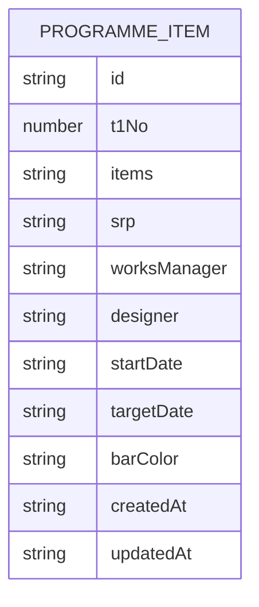

## 1. Architecture Design
The app is a static frontend-only single-page application. Data persists in browser local storage.

## 2. Technology Description
- Frontend: React@18 + TypeScript + Vite
- Styling: Tailwind CSS (utility-first) + a small layer of design tokens (CSS variables)
- Data persistence: localStorage (no backend in v1)
- Initialization Tool: Vite

## 3. Route Definitions
| Route | Purpose |
|-------|---------|
| / | Dashboard table + editor |

## 4. Data Model

### 4.1 Data Model Definition
Single collection stored in local storage as JSON.

### 4.2 Validation Rules
- t1No: required, integer, unique in the list (client-side enforcement)
- items: required
- startDate/targetDate: required; targetDate must be on/after startDate
- barColor: required; default provided if user does not set it

## 5. Key UI Behaviors
- Sorting: stable sorting with per-column toggles (ascending/descending/none)
- Filtering: global search + per-column filters applied before sorting
- Schedule bar rendering: bar width reflects the row’s date range relative to the current filtered dataset’s min/max dates (so bars remain meaningful within the current view)
- Editing: optimistic UI update + immediate save to local storage
